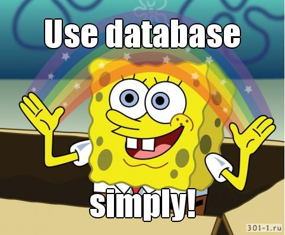

[](http://godoc.org/github.com/ignusius/simpledb)
[](https://travis-ci.org/ignusius/simpledb)

# simpledb #

This library for simple use Databases (It works with drivers for database/sql).

## LICENSE ##
```
 This program is free software: you can redistribute it and/or modify
 it under the terms of the GNU General Public License as published by
 the Free Software Foundation, either version 3 of the License, or
 (at your option) any later version.

 This program is distributed in the hope that it will be useful,
 but WITHOUT ANY WARRANTY; without even the implied warranty of
 MERCHANTABILITY or FITNESS FOR A PARTICULAR PURPOSE.  See the
 GNU General Public License for more details.

 You should have received a copy of the GNU General Public License
 along with this program.  If not, see <http://www.gnu.org/licenses/>.
```
## How do I install it? ##
```
go get bitbucket.org/ignusius/simpledb
```

## Note ##

```
MySQL               PostgreSQL            SQlite

WHERE col = ?       WHERE col = $1        WHERE col = $1 
VALUES(?, ?, ?)     VALUES($1, $2, $3)    WHERE col = ?
                                          VALUES($1, $2, $3) 
										  VALUES(?, ?, ?)
```

## Example SQLite ##

example.go

```go
package main

import (
	"fmt"

	"bitbucket.org/ignusius/simpledb"
	_ "github.com/mattn/go-sqlite3"
)

func main() {
	db := new(simpledb.DB)
	// or db:=simpledb.DB{}
	err := db.NewDatabase("sqlite3", "test.db")
	if err != nil {
		panic(err)
	}

	err = db.Exec("INSERT INTO data values ($1,$2,$3,$4,$5)", 1,"test","test",2,3)
	if err !=nil{
		panic(err)
	}

	arr, err := db.Query("SELECT * FROM data")
	if err != nil {
		panic(err)
	}
	fmt.Println(arr)
	fmt.Println(arr[0][2])

	db.Close()
}
```

## Example PostgeSQL ##

example.go
```go
package main

import (
	"fmt"

	"bitbucket.org/ignusius/simpledb"
	_ "github.com/lib/pq"
)

func main() {
	db := new(simpledb.DB)
	// or db:=simpledb.DB{}
	err := db.NewDatabase("postgres", `dbname=test user=test password=pass host=localhost port=5432  sslmode=disable`)
	if err != nil {
		panic(err)
	}

	err = db.Exec("INSERT INTO data values ($1,$2,$3,$4,$5)", 1,"test","test",2,3)
	if err !=nil{
		panic(err)
	}

	arr, err := db.Query("SELECT * FROM data")
	if err != nil {
		panic(err)
	}
	fmt.Println(arr)
	fmt.Println(arr[0][2])

	db.Close()
}
```

## Example MySQL ##

example.go

```go
package main

import (
	"fmt"

	"simpledb"

	_ "github.com/go-sql-driver/mysql"
)

func main() {
	db := new(simpledb.DB)

	// or db:=simpledb.DB{}
	err := db.NewDatabase("mysql", "root:password@tcp(127.0.0.1:3306)/test")
	if err != nil {
		panic(err)
	}
	defer db.Close()

	err = db.Exec("INSERT INTO data values (?,?,?,?,?)", 1, "test", "test", 2, 3)
	if err != nil {
		panic(err)
	}

	arr, err := db.Query("SELECT * FROM data")
	if err != nil {
		panic(err)
	}

	fmt.Println(arr)
	fmt.Println(arr[0][2])

}
```

Output
```
[[1 test test 2 3]]
test
```

## Transactions ##

```go
package main

import (
    "fmt"

    "simpledb"
    _ "github.com/mattn/go-sqlite3"
)

func main() {

    db := new(simpledb.DB)
    // or db:=simpledb.DB{}
    err := db.NewDatabase("sqlite3", "test")
    if err != nil {
        panic(err)
    }
    db.Begin()
    

    db.TxPrepare("INSERT INTO data values ($1,$2,$3,$4,$5)")
    db.StmtExec(1,2,3,4,5)
    db.StmtExec(1,2,3,4,5)
    db.StmtExec(1,2,3,4,5)
    db.StmtExec(1,2,3,4,5)
    db.StmtExec(1,2,3,4,5)
	db.StmtClose()
    //db.Rollback()
 
    db.Commit()
   

    arr, err := db.Query("SELECT * FROM data")
    if err != nil {
        panic(err)
    }
    fmt.Println(arr)

    db.Close()
}
```
Output
```
[[1 2 3 4 5] [1 2 3 4 5] [1 2 3 4 5] [1 2 3 4 5] [1 2 3 4 5]]
```



### Contacts ###

ignusius@gmail.com
